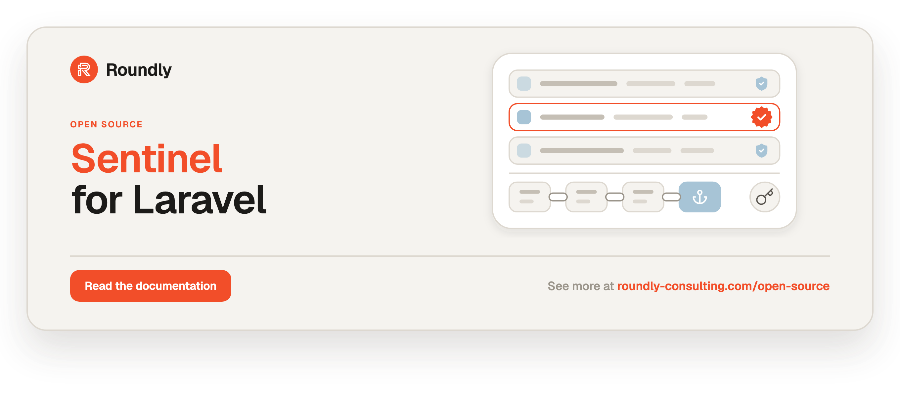

<!-- roundly-hero:start -->
<p align="center">
  <a href="https://roundly-consulting.com/open-source/docs/sentinel-for-laravel?utm_source=github&utm_medium=readme&utm_campaign=open-source&utm_content=sentinel-for-laravel">
    
  </a>
</p>
<!-- roundly-hero:end -->

<!-- roundly-badges:start -->
<p align="center">
  <a href="https://packagist.org/packages/roundly-consulting/sentinel-for-laravel"></a>
  <a href="https://github.com/roundly-consulting/sentinel-for-laravel/actions/workflows/run-tests.yml"></a>
  <a href="https://github.com/roundly-consulting/sentinel-for-laravel/actions/workflows/fix-php-code-style-issues.yml"></a>
  <a href="https://donate.stripe.com/dRmeVe8FX5PF1Qd9pXcEw00"></a>
  <a href="https://www.patreon.com/cw/roundly"></a>
  <a href="https://roundly-consulting.com/support-us?utm_source=github&utm_medium=readme&utm_campaign=open-source&utm_content=sentinel-for-laravel#crypto"></a>
</p>
<!-- roundly-badges:end -->

# Sentinel for Laravel

Know when your data was changed behind your application's back, and make every request
count once. Sentinel seals Eloquent models with keyed MACs or signatures, detects any change
made outside the application (a SQL console, a mass `update()`, a restored backup), and adds
the request-integrity tools around it: idempotency keys, single-use nonces and URLs, and
RFC 9421 HTTP message signatures.

- **Seals** — named, typed seals declared on the model, written atomically with every
  Eloquent write, verified anywhere (API, middleware, validation rule, collection, retrieve,
  console scan). Writes to a tampered row are refused until someone acknowledges the change
  with a reason.
- **Ledger** — an append-only, MAC'd history of every seal event, folded into chained
  checkpoints and optionally published to external anchors, so deleted or rolled-back
  history is detectable.
- **Keys** — HMAC-SHA-256/384/512, Ed25519 and ECDSA P-256/P-384 keys in named rings, from
  the environment or encrypted database rows, with rotation, revocation and retirement —
  and partner keys imported at runtime, bound to the partner model.
- **Requests** — `Idempotency-Key` handling (HTTP and queued jobs), nonces, single-use signed
  URLs and HTTP message signatures in and out.
- **Operations** — a guided `sentinel:install`, a one-command health check
  (`sentinel:check`) and upkeep that schedules itself.

Built only on Laravel and three Roundly Tier-0 packages (`package-toolkit`, `enums`,
`crypto`).

This README covers installation, configuration and the whole public API. The
[full documentation](https://roundly-consulting.com/open-source/docs/sentinel-for-laravel?utm_source=github&utm_medium=readme&utm_campaign=open-source&utm_content=sentinel-for-laravel)
adds the reference pages: the canonical format, the database schema, every exception and enum,
the extension contracts in depth and the standards Sentinel implements.

## Contents

- [Requirements](#requirements)
- [Installation](#installation)
- [Quick start](#quick-start)
- [What it detects (threat model)](#what-it-detects-threat-model)
- [Configuration](#configuration)
- [Declaring seals](#declaring-seals)
- [Sealing and writes](#sealing-and-writes)
- [Verifying](#verifying)
- [Acknowledging out-of-band changes](#acknowledging-out-of-band-changes)
- [Bulk operations](#bulk-operations)
- [Ledger, checkpoints and anchors](#ledger-checkpoints-and-anchors)
- [Middleware, validation rule, collection macro and scopes](#middleware-validation-rule-collection-macro-and-scopes)
- [Idempotency keys](#idempotency-keys)
- [Nonces and single-use URLs](#nonces-and-single-use-urls)
- [HTTP message signatures](#http-message-signatures)
- [Key management](#key-management)
- [Commands, scheduling and the health check](#commands-scheduling-and-the-health-check)
- [Events](#events)
- [Extending](#extending)
- [Without the facade](#without-the-facade)
- [API reference](#api-reference)
- [Testing your application](#testing-your-application)
- [Naming](#naming)

## Requirements

- PHP 8.4+ with `ext-hash` and `ext-mbstring`; `ext-sodium` for `ed25519` keys
- Laravel 12.x or 13.x
- SQLite, PostgreSQL or MySQL (every table and every race is tested on all three engines)

## Installation

```bash
composer require roundly-consulting/sentinel-for-laravel
php artisan sentinel:install
```

`sentinel:install` publishes the configuration and the migrations, shows the morph key types
to settle before migrating, generates the default ring's key when it has none (printed as
environment lines — `.env` is never written) and prints the next steps. Running it again is
harmless (`--force` overwrites published files). The same steps by hand:

Publish and run the migrations (six tables, all prefixed `sentinel_`):

```bash
php artisan vendor:publish --tag="sentinel-migrations"
php artisan migrate
```

Optionally publish the configuration file and the translations (English and Slovak):

```bash
php artisan vendor:publish --tag="sentinel-config"
php artisan vendor:publish --tag="sentinel-translations"
```

Generate the key of the default ring. It is printed as environment lines — add them to
`.env` and treat them as secrets; the command never writes `.env` itself:

```bash
php artisan sentinel:key:generate
# SENTINEL_KEY_ID=default-20261002-k3f9qa
# SENTINEL_ALGORITHM=hmac-sha256
# SENTINEL_KEY="base64:…"
```

Set `sentinel.key_type` (and `sentinel.actor_key_type`) to `uuid` or `ulid` **before**
migrating if your sealed models (or your users) use those keys.

## Quick start

Declare a seal on the model:

```php
use Illuminate\Database\Eloquent\Model;
use RoundlyConsulting\Sentinel\Concerns\HasSeals;
use RoundlyConsulting\Sentinel\Contracts\Sealable;
use RoundlyConsulting\Sentinel\Definition\SealBuilder;

final class Invoice extends Model implements Sealable
{
    use HasSeals;

    public static function defineSeals(SealBuilder $seals): void
    {
        $seals->seal('financial')->attributes('customer_id', 'currency', 'amount', 'status');
    }
}
```

Every Eloquent write now seals the row. Rows that existed before get a baseline once:

```bash
php artisan sentinel:seal-missing "App\Models\Invoice" --reason="Initial baseline"
```

Verify wherever it matters:

```php
use RoundlyConsulting\Sentinel\Facades\Sentinel;

$invoice->isIntact();                          // true when every seal verifies
Sentinel::for($invoice)->verifyOrFail();       // throws TamperedModelException otherwise

Route::get('/invoices/{invoice}', ShowInvoice::class)->middleware('sentinel.verified');
```

Someone runs `UPDATE invoices SET amount = 0 WHERE id = 42` in a SQL console:

```php
Sentinel::for($invoice)->verify();
// VerificationResult { status: Tampered, reason: 'mac', changedAttributes: ['a:amount'], … }

$invoice->update(['note' => 'x']);             // TamperedModelException: refused until acknowledged

Sentinel::for($invoice)->by($admin)->because('INC-88: refund fixed by the DBA')->acknowledge();
```

Nothing to schedule: Sentinel registers its upkeep on the Laravel scheduler itself — a
ledger checkpoint every minute, a full `sentinel:verify --ledger` and `sentinel:prune` daily
(run `php artisan schedule:run` every minute as for any scheduled task; set
`SENTINEL_SCHEDULE=false` to wire the commands yourself). `sentinel:verify` without arguments
scans every sealable model it knows — those listed in `sentinel.models` and every class that
has seals — and exits 2 when there is nothing to scan, so a misconfiguration never reports
green. Then check the installation:

```bash
php artisan sentinel:check
```

## What it detects (threat model)

Sentinel **detects**; database grants and row-level security **prevent**. The two complement
each other.

### Actors

| Id | Actor | Capabilities | In scope |
|---|---|---|---|
| A1 | **DB writer** | `INSERT/UPDATE/DELETE` on any table incl. `sentinel_*`; no code execution; no access to env/config/`APP_KEY` | yes |
| A2 | **DB writer + snapshot restore** | A1 + replace tables or the whole database with an older snapshot | yes (needs anchors for full coverage) |
| A3 | **Network/client attacker** | replays, alters or duplicates HTTP requests | yes |
| A4 | **Authorised insider** | uses the app normally (e.g. acknowledges changes) | audited (actor + reason + changed attributes in the MAC'd ledger); authorisation is the host's job (Gate hook) |
| A5 | holder of signing keys / `APP_KEY` (database-driver keys) / RCE / config write | can forge anything | out of scope |

### Detection matrix

"Window" means the time since the last checkpoint (default: scheduled every minute).

| # | Attack | DB-only (no anchor) | With ≥ 1 external anchor | Status / finding |
|---|---|---|---|---|
| 1 | Change a sealed column | yes | yes | `Tampered` (+ changed attributes via field tags) |
| 2 | Change rows feeding a computed value | yes | yes | `Tampered` |
| 3 | Copy values + seal from another row / model / seal name / tenant scope / app context | yes (domain separation) | yes | `Tampered` |
| 4 | Re-point a seal row (`sealable_id`, `seal`) | yes | yes | `Tampered` |
| 5 | Delete a seal row | yes | yes | `Missing` (`seal_deleted` when ledger history exists) |
| 6 | Insert an unsealed row (strict seal) | yes | yes | `Missing` (`never_sealed`); a lenient seal → `Unsealed` (by definition not a finding) |
| 7 | Restore an older row + its older seal row | yes, while the newer ledger entries exist | yes | `Stale` (`newer_version`) |
| 8 | #7 + delete the newer ledger entries | yes if those entries were already checkpointed (`CheckpointMismatch`); no inside the window | yes outside the window | ledger findings |
| 9 | Restore the **whole** database (incl. ledger + checkpoints) to an older snapshot | no | yes (`AnchorAhead`) for any rollback past the last anchored checkpoint | ledger finding |
| 10 | Delete the checkpoint tail (+ entries) | no | yes | `AnchorAhead` |
| 11 | Rewrite a ledger entry or checkpoint | yes (entry MAC / checkpoint MAC + chain) | yes | `EntryInvalid`, `CheckpointInvalid`, `ChainBroken` |
| 12 | Delete a sealable row without a tombstone | yes (`sentinel:verify --ledger`: live ledger head, row gone) | yes | `EntityDeleted` |
| 13 | Rewrite the stored `algorithm` / `key_id` / `ring` on a seal row | yes (the algorithm comes from the key; ring allow-list; HKDF info binds ring + kid + algorithm) | yes | `AlgorithmMismatch` / `UnknownKey` / `Tampered` |
| 14 | Database-driver key rows: swap ring/kid/algorithm, replace a public key, plant an envelope minted through an `encrypted` cast | yes (an AEAD envelope under its own APP_KEY-derived key binds every field and its row) | yes | `KeyIntegrityException` → `UnknownKey` |
| 15 | Database-driver key rows: restore an older envelope (un-revoke a key) | no (an authentic old ciphertext) — mitigation: list the kid in `SENTINEL_REVOKED_KEYS`, which always wins | no | — |
| 16 | Changes made **and** rolled back entirely inside the window | no | no | — (shorten the checkpoint interval) |
| 17 | Replay a signed HTTP request | yes (`created`/`expires` window + nonce de-duplication) | — | `replayed`, `too_old`, `expired` |
| 18 | Alter the body/headers of a signed request, or add a method override | yes (`content-digest` + signature; the executed method must be the signed one) | — | `digest_mismatch`, `invalid_signature`, `malformed` |
| 19 | Duplicate a POST (retry storm, double click) | yes (replay / 409) | — | idempotency |
| 20 | Reuse an idempotency key with another payload | yes (422) | — | idempotency |
| 21 | Reuse a single-use URL | yes (atomic consume) | — | 403 |

### What it does not guarantee

- Sentinel detects; it does not prevent. A row may be tampered with between two
  verifications.
- Rows written through the query builder, raw SQL or `withoutSealing()` are unsealed or stale
  until re-sealed. Strict seals report them.
- Database-driver keys are only as safe as `APP_KEY`. The `config` driver keeps keys out of
  the database (recommended for the default ring).
- Without an external anchor, a full-database rollback (#9) and checkpoint truncation (#10)
  are undetectable.
- Verification proves integrity relative to the last authorised seal, **not** that the
  authorised value was correct.
- Computed values that read related rows are only as fresh as the last re-seal of the owning
  model.

Out of scope by design: confidentiality (use Laravel's `encrypted` casts), an attacker holding
the signing keys, `APP_KEY` (for database-driver keys), the deployed code or the
configuration, and intercepting query-builder or raw SQL writes (they are detected
afterwards).

## Configuration

The published `config/sentinel.php` documents every key. All of them:

| Key | Type | Default | Env | Purpose |
|---|---|---|---|---|
| `context` | string (UTF-8, ≤ 255 bytes) | `''` | `SENTINEL_CONTEXT` | Application domain separator bound into every MAC. Changing it invalidates every seal (re-seal). |
| `key_type` | `bigint`\|`uuid`\|`ulid` | `bigint` | `SENTINEL_KEY_TYPE` | Id type of sealed models in the morph columns (set before migrating). |
| `actor_key_type` | `bigint`\|`uuid`\|`ulid` | `bigint` | `SENTINEL_ACTOR_KEY_TYPE` | Id type of actors, key owners and nonce subjects. |
| `models` | list of class-strings | `[]` | — | Models `sentinel:verify` scans first when given none; every class that has seals is discovered after them. |
| `database.connection` | ?string | `null` | `SENTINEL_DB_CONNECTION` | Connection of `sentinel_keys`, `sentinel_idempotency_keys`, `sentinel_nonces`. |
| `keys.default_ring` | ring name (`[a-z][a-z0-9_-]{0,63}`) | `default` | `SENTINEL_DEFAULT_RING` | Ring used by seals that name none. Never a ring HTTP message signatures use (refused). |
| `keys.revoked` | string (`ring:kid,…`) | `''` | `SENTINEL_REVOKED_KEYS` | Revoked keys — beats every driver, survives a restored key row. |
| `keys.rings.default.driver` | string | `config` | `SENTINEL_KEY_DRIVER` | `config`, `database`, `chain` or a custom driver. |
| `keys.rings.default.algorithms` | list | all six | — | The ring's algorithm allow-list. |
| `keys.rings.default.key_id` | ?key id (`[A-Za-z0-9][A-Za-z0-9._-]{0,63}`) | `null` | `SENTINEL_KEY_ID` | Config driver: the current key id. |
| `keys.rings.default.algorithm` | string | `hmac-sha256` | `SENTINEL_ALGORITHM` | Config driver: the current key's algorithm. |
| `keys.rings.default.key` | ?string | `null` | `SENTINEL_KEY` | Config driver: `base64:` secret or private key. |
| `keys.rings.default.public_key` | ?string | `null` | `SENTINEL_PUBLIC_KEY` | Config driver: `base64:` public key (verify-only nodes). |
| `keys.rings.default.previous` | string | `''` | `SENTINEL_PREVIOUS_KEYS` | Config driver: verify-only keys, `kid\|algorithm\|base64:…` comma-separated. |
| `keys.rings.default.drivers` | list | `['config', 'database']` | — | Chain driver order. |
| `keys.rings.http.driver` | string | `database` | `SENTINEL_HTTP_KEY_DRIVER` | Driver of the RFC 9421 ring. |
| `keys.rings.http.algorithms` | list | the four RFC 9421 algorithms | — | The `http` ring's allow-list. |
| `keys.rings.http.key_id` / `algorithm` / `key` / `public_key` / `previous` / `drivers` | as above | as above | `SENTINEL_HTTP_KEY_ID`, `SENTINEL_HTTP_ALGORITHM`, `SENTINEL_HTTP_KEY`, `SENTINEL_HTTP_PUBLIC_KEY`, `SENTINEL_HTTP_KEYS` | When the `http` ring uses the config driver. |
| `sealing.auto` | bool | `true` | `SENTINEL_AUTO_SEAL` | Seal on Eloquent writes (turn off on verify-only nodes). |
| `sealing.on_tampered_write` | `refuse`\|`reseal`\|`skip` | `refuse` | `SENTINEL_ON_TAMPERED_WRITE` | What an Eloquent write does to a model that is not intact. |
| `sealing.allow_suspension` | bool | `true` | `SENTINEL_ALLOW_SUSPENSION` | Permit `Sentinel::withoutSealing()`. |
| `sealing.field_tags` | bool | `true` | `SENTINEL_FIELD_TAGS` | Keyed per-field tags that name changed attributes (HMAC keys). |
| `sealing.reason_max_length` | int 1–10000 | `1000` | — | Acknowledgement, unseal and baseline reasons. |
| `sealing.transaction_attempts` | int 1–10 | `3` | — | Retries of Sentinel's own transactions (never the host's `save()`). |
| `verification.check_ledger` | bool | `true` | `SENTINEL_VERIFY_LEDGER` | Compare seals with the ledger (detects replayed seals). |
| `verification.outdated_is_intact` | bool | `true` | `SENTINEL_OUTDATED_IS_INTACT` | A changed definition over intact data counts as intact. |
| `verification.log_channel` | ?string | `null` | `SENTINEL_LOG_CHANNEL` | Where findings are logged (null = default channel). |
| `verification.retrieve_reaction` | `throw`\|`event`\|`log` | `throw` | `SENTINEL_RETRIEVE_REACTION` | Default reaction of verify-on-retrieve. |
| `verification.retrieve_checks_ledger` | bool | `false` | `SENTINEL_RETRIEVE_CHECKS_LEDGER` | Ledger check on retrieve (one more query per model). |
| `acknowledgement.ability` | ?string | `null` | `SENTINEL_ACKNOWLEDGE_ABILITY` | Gate ability checked before an acknowledgement. |
| `ledger.enabled` | bool | `true` | `SENTINEL_LEDGER` | Write ledger entries (off loses replay/rollback detection). |
| `ledger.ring` | a configured ring (null = `keys.default_ring`) | `default` | `SENTINEL_LEDGER_RING` | Ring whose current key signs checkpoints; an unconfigured ring, or one HTTP message signatures use, is refused. |
| `ledger.connections` | non-empty list (null = the default connection) | `[null]` | — | Connections holding seals and the ledger; every scan, count and check covers each one — once (`null` and the default connection's name are one entry). |
| `ledger.batch_size` | int 1–100000 | `1000` | — | Entries per checkpoint transaction. |
| `ledger.backlog_warning_seconds` | int 60–86400 | `600` | — | Age of un-checkpointed entries reported as a backlog. |
| `ledger.anchors` | comma list of names (`[a-z][a-z0-9_-]{0,63}`) | `''` | `SENTINEL_ANCHORS` | `cache`, `filesystem`, `log` or custom anchors. |
| `ledger.anchor_drivers.cache.store` | ?string | `null` | `SENTINEL_ANCHOR_CACHE_STORE` | Cache store of the cache anchor (not the app database). |
| `ledger.anchor_drivers.cache.key` | string | `sentinel:ledger:anchor` | — | Cache key prefix. |
| `ledger.anchor_drivers.filesystem.disk` | string | `local` | `SENTINEL_ANCHOR_DISK` | Disk of the filesystem anchor (object lock recommended). |
| `ledger.anchor_drivers.filesystem.path` | string | `sentinel/anchors` | `SENTINEL_ANCHOR_PATH` | Directory on that disk. |
| `ledger.anchor_drivers.log.channel` | ?string | `null` | `SENTINEL_ANCHOR_LOG_CHANNEL` | Log channel of the write-only log anchor. |
| `middleware.verified_status` | int 400–599 | `409` | — | Status of `sentinel.verified` on a failed check. |
| `middleware.verified_reaction` | `abort`\|`report` | `abort` | `SENTINEL_VERIFIED_REACTION` | Abort, or only report and continue. |
| `idempotency.store` | store name (`[a-z][a-z0-9_-]{0,63}`) | `database` | `SENTINEL_IDEMPOTENCY_STORE` | `database`, `cache` or a bound custom store. |
| `idempotency.cache_store` | ?string | `null` | `SENTINEL_IDEMPOTENCY_CACHE_STORE` | Lock-capable cache store for the cache store. |
| `idempotency.header` | header name (`[A-Za-z0-9-]{1,64}`) | `Idempotency-Key` | — | Request header. |
| `idempotency.replay_header` | header name | `Idempotent-Replayed` | — | Header on replayed responses. |
| `idempotency.methods` | non-empty list of HTTP methods | `['POST', 'PATCH']` | — | Methods the middleware applies to. |
| `idempotency.ttl` | int 60–2592000 | `86400` | `SENTINEL_IDEMPOTENCY_TTL` | Seconds a key lives after it was first seen. |
| `idempotency.lock_seconds` | int 1–3600 | `60` | — | Lease of a request in progress. |
| `idempotency.min_length` / `max_length` | int 1–255 | `16` / `255` | — | Accepted key length. |
| `idempotency.accept_unquoted` | bool | `true` | `SENTINEL_IDEMPOTENCY_ACCEPT_UNQUOTED` | Accept bare (unquoted) keys. |
| `idempotency.store_client_errors` | bool | `true` | — | Store and replay 4xx responses. |
| `idempotency.store_server_errors` | bool | `false` | — | Store 5xx responses (default: release the key). |
| `idempotency.transactional` | bool | `false` | `SENTINEL_IDEMPOTENCY_TRANSACTIONAL` | Handler and record in one transaction. Needs `idempotency.store = database` (a cache record is not rolled back with a failed COMMIT) — refused otherwise. |
| `idempotency.encrypt` | bool | `true` | `SENTINEL_IDEMPOTENCY_ENCRYPT` | Encrypt stored responses. |
| `idempotency.max_response_bytes` | int 1024–67108864 | `1048576` | — | Larger responses are not replayable. |
| `idempotency.replayed_headers` | list of header names | `content-type`, `content-language`, `location`, `etag`, `last-modified`, `cache-control` | — | Headers stored and replayed (`set-cookie` never). |
| `nonces.store` | store name (`[a-z][a-z0-9_-]{0,63}`) | `database` | `SENTINEL_NONCE_STORE` | `database`, `cache` or a bound custom store. |
| `nonces.cache_store` | ?string | `null` | `SENTINEL_NONCE_CACHE_STORE` | Lock-capable cache store. |
| `nonces.ttl` | int 1–2592000 | `900` | — | Seconds a nonce lives. |
| `nonces.length` | int 32–128 | `43` | — | Nonce length in base64url characters (43 ≈ 256 bits). |
| `problems.type_base` | ?string (absolute URL) | `null` | `SENTINEL_PROBLEM_TYPE_BASE` | RFC 9457 `type` = base + `#code` (null: omitted). |
| `signatures.default_profile` | profile name (`[a-z][a-z0-9_-]{0,63}`) | `default` | — | Profile of `sentinel.signed` without a parameter. |
| `signatures.profiles.<name>.ring` | a configured ring | `http` | — | Ring the profile's key ids resolve in. |
| `signatures.profiles.<name>.label` | ?label (`[a-z*][a-z0-9_-.*]{0,63}`) | `null` | — | Signature label to verify (null: the only one, or the one with the profile tag). |
| `signatures.profiles.<name>.tag` | ?string (printable ASCII, ≤ 255) | `null` | — | Required `tag` parameter. |
| `signatures.profiles.<name>.components` | list | `@method`, `@authority`, `@path` | — | Components that must be covered. |
| `signatures.profiles.<name>.require_query` | bool | `true` | — | Cover `@query` when the request has a query. |
| `signatures.profiles.<name>.require_content_digest` | bool | `true` | — | Cover `content-digest` when there is a body. |
| `signatures.profiles.<name>.require_nonce` | bool | `true` | — | Require (and de-duplicate) a `nonce`. |
| `signatures.profiles.<name>.max_age` | int 1–86400 | `300` | — | Seconds a signature is accepted after `created`. |
| `signatures.profiles.<name>.clock_skew` | int 0–3600 | `30` | — | Allowed clock difference in seconds. |
| `signatures.profiles.<name>.algorithms` | non-empty list (required) | the four RFC 9421 algorithms | — | Allowed algorithms; an empty list is a configuration error (fail closed). |
| `signatures.profiles.<name>.accept_signing_keys` | bool | `false` | — | Accept a key this application can sign with (generated here, or imported with `signing: true`). Off: a request the app signed itself never passes as a partner's. |
| `signatures.outbound.ring` | a configured ring | `http` | — | Ring of `Http::withSignature()` keys. |
| `signatures.outbound.label` | label (`[a-z*][a-z0-9_-.*]{0,63}`) | `sig1` | — | Label of outgoing signatures. |
| `signatures.outbound.components` | list | `@method`, `@authority`, `@path`, `@query`, `content-digest`, `content-type` | — | Components signed (absent ones are dropped). |
| `signatures.outbound.digest` | `sha-256`\|`sha-512` | `sha-256` | — | `Content-Digest` algorithm. |
| `signatures.outbound.expires_in` | ?int 1–86400 | `null` | — | Seconds until the `expires` parameter (null: none). |
| `signatures.outbound.tag` | ?string (printable ASCII, ≤ 255) | `null` | — | `tag` parameter. |
| `signatures.outbound.include_alg` | bool | `false` | — | Send the `alg` parameter. |
| `signatures.advertise` | bool | `true` | `SENTINEL_ADVERTISE_SIGNATURE` | `Accept-Signature` on 401 responses. |
| `schedule.enabled` | bool | `true` | `SENTINEL_SCHEDULE` | Register the upkeep tasks on the scheduler (off: schedule the commands yourself). |
| `schedule.checkpoint` | frequency \| `off` | `everyMinute` | `SENTINEL_SCHEDULE_CHECKPOINT` | `sentinel:checkpoint` (only while the ledger is on) — the rollback window. |
| `schedule.verify` | frequency \| `off` | `daily` | `SENTINEL_SCHEDULE_VERIFY` | `sentinel:verify --allow-empty --ledger`; `hourly` suits small tables. |
| `schedule.prune` | frequency \| `off` | `daily` | `SENTINEL_SCHEDULE_PRUNE` | `sentinel:prune`. |

Frequencies are `everyMinute`, `everyTwoMinutes`, `everyFiveMinutes`, `everyTenMinutes`,
`everyFifteenMinutes`, `everyThirtyMinutes`, `hourly`, `everyTwoHours`, `everyThreeHours`,
`everyFourHours`, `everySixHours`, `daily` and `weekly`; each task runs without overlapping and
on one server.

Ring, profile, anchor and store names follow `[a-z][a-z0-9_-]{0,63}`. Add rings under
`keys.rings.<ring>` (`driver` and `algorithms` required; for a config-driver ring,
`sentinel:key:generate --ring=<ring>` prints `SENTINEL_<RING>_*` lines — read them in the
ring's section with `env()`) and inbound policies under `signatures.profiles.<name>`.

**How values are read.** Every setting is validated at first use, and an invalid one throws
`InvalidSentinelConfigurationException` naming the key — it never falls back to a default.
Booleans accept `true`/`false`, `on`/`off`, `yes`/`no`, `1`/`0` (any case) and `''` (false);
any other value throws (`SENTINEL_ALLOW_SUSPENSION=disabled` is an error, never "allowed"),
and only an unset key takes its default. A value out of range, an unknown enum case or a
malformed list throws the same way. `php artisan about` shows a Sentinel section
(rings, driver, signing key present or missing, flags, anchors, stores, sealable models,
schedule — never key material), and `sentinel:check` reports every invalid setting at once.

**Translations** (English and Slovak; `php artisan vendor:publish --tag="sentinel-translations"`
to reword them or add a locale):

| Key | Used by |
|---|---|
| `sentinel::messages.tampered` | the generic `sentinel.verified` failure message |
| `sentinel::messages.problems.<code>.title` / `.detail` | RFC 9457 problem responses — codes `idempotency_key_missing`, `invalid_idempotency_key`, `idempotency_key_reused`, `idempotency_request_in_progress`, `idempotent_response_unavailable`, `nonce_rejected`, `signature_rejected` |
| `sentinel::validation.intact_seal` | the `IntactSeal` rule (`:attribute`) |
| `sentinel::statuses.<status>` | status labels in `sentinel:verify` output, one per `VerificationStatus` value |

## Declaring seals

A sealable model implements `Sealable`, uses `HasSeals` and declares one or more named seals.
The first seal is the default one.

```php
use Illuminate\Database\Eloquent\Model;
use RoundlyConsulting\Sentinel\Concerns\HasSeals;
use RoundlyConsulting\Sentinel\Contracts\Sealable;
use RoundlyConsulting\Sentinel\Definition\SealBuilder;
use RoundlyConsulting\Sentinel\Enums\Algorithm;
use RoundlyConsulting\Sentinel\Enums\Reaction;

final class Invoice extends Model implements Sealable
{
    use HasSeals;

    public static function defineSeals(SealBuilder $seals): void
    {
        $seals->seal('financial')
            ->attributes('customer_id', 'currency', 'amount', 'status', 'paid', 'due_on')
            ->decimal('amount', 2)
            ->computed('lines', static fn (Invoice $invoice): array => $invoice->lines()
                ->orderBy('id')->get(['sku', 'quantity'])->toArray())
            ->algorithms(Algorithm::HmacSha256, Algorithm::Ed25519)
            ->scope(static fn (Invoice $invoice): string => (string) $invoice->tenant_id)
            ->verifyOnRetrieve(Reaction::Throw);

        $seals->seal('identity')->using(PartyIdentitySeal::class)->lenient();
    }
}
```

A reusable definition is a class implementing `Contracts\SealDefinition`:

```php
use RoundlyConsulting\Sentinel\Contracts\SealDefinition;
use RoundlyConsulting\Sentinel\Definition\SealDefinitionBuilder;

final class PartyIdentitySeal implements SealDefinition
{
    public function define(SealDefinitionBuilder $seal): void
    {
        $seal->attributes('number', 'meta')->plaintext('secret');
    }
}
```

| Builder method | Effect |
|---|---|
| `attributes(...$columns)` | Columns covered, typed from the model's casts. Never `*`; the primary key is always bound. |
| `string()`, `integer()`, `boolean()`, `decimal($column, $scale)`, `float($column, $scale)`, `datetime()`, `date()`, `json()`, `binary()`, `plaintext()` | Add columns with an explicit type. Floats must be declared with a scale; `plaintext()` seals the decrypted value of an `encrypted` cast. |
| `computed($name, $resolver, ?SealType $as)` | A value computed from the model (a static closure), e.g. related rows. |
| `ring($ring)`, `acceptRings(...$rings)`, `algorithms(...$algorithms)` | Key ring, extra rings accepted during a ring migration, algorithm allow-list. |
| `strict()` / `lenient()` | A missing seal is a finding (default) / is `Unsealed`. |
| `auto()` / `manual()` | Seal on Eloquent writes (default) / only explicitly. |
| `verifyOnRetrieve(?Reaction $reaction)` | Verify every retrieved model: `Throw`, `Event` or `Log`. |
| `fieldTags(bool)` | Store keyed per-field tags so failures name the changed attributes (HMAC keys). |
| `scope($resolver)` | A tenant (or other) scope bound into the MAC. |
| `onTamperedWrite(TamperedWritePolicy)` | Per-seal override of `sealing.on_tampered_write`. |
| `using(SealDefinition::class)` | Apply a reusable definition first; inline calls win. |

Computed values that read related rows go stale when those rows change without a save of
the owner. Re-seal the owner — `Sentinel::seal($invoice)` re-seals computed-only drift and
records it — or touch it from the child's `saved` hook (`$line->invoice->touch()`).

A definition is compiled once per process — when the model class boots, so an invalid one
fails on the first `new` — and validated as a whole: an unknown ring, an undeclared float, a
closure that is not `static`, a duplicate field — every problem is listed in one
`InvalidSealDefinitionException`. Reading a model costs nothing extra unless one of its seals
declares `verifyOnRetrieve()`. Values are canonicalized from what the database
holds (read back under a row lock), typed and engine-portable — see the technical docs for
the frozen `sentinel.seal/1` format.

## Sealing and writes

- **Automatic.** Creating a model seals it; an update re-seals the seals whose columns
  changed (seals with computed values re-seal on every update). The write and its seal are one
  transaction: if sealing fails, the write rolls back. Every Eloquent write path is covered —
  `save`, `update`, `create`, `firstOrCreate`, `updateOrCreate`, `touch`, `push`, `increment`
  and `decrement` (also `incrementEach`), `restore`, `delete`, `forceDelete` and the quiet
  variants.
- **Explicit.** `Sentinel::seal($invoice)`, `Sentinel::for($invoice)->because('…')->seal()` or
  `$invoice->seal()`. An explicit seal never launders: a tampered model must be acknowledged.
- **Tampered writes.** Before an update the row is locked and verified. A model changed
  outside the application is **refused** (`TamperedModelException`, nothing written) unless
  `sealing.on_tampered_write` (or the seal's `onTamperedWrite()`) says `reseal` (write and
  audit the previous status) or `skip` (write, leave the seal stale).
- **Deletes** are never refused. A hard delete removes the seal rows and writes a `deleted`
  tombstone to the ledger for every seal, `manual()` ones included; a soft delete keeps the
  seal; deleting an unsaved model does nothing (it returns `null`). With `sealing.auto` off or
  inside `withoutSealing()` no tombstone is written, so the ledger scan reports the delete.
- **Suspension** for seeders and imports — audited by a `SealingSuspended` event, refused
  when `sealing.allow_suspension` is off:

```php
Sentinel::withoutSealing(fn () => Invoice::query()->create($row), reason: 'Legacy import');
```

- **Overriding `save()` or `delete()`** in the class that uses `HasSeals`: route the parent
  call through `persistSealed()`. A subclass simply calls `parent::save()`, which is the
  sealed one. A save or delete that bypasses the sealed path is refused before anything is
  written (`SealingMisconfiguredException`):

```php
public function save(array $options = []): bool
{
    $this->number = trim((string) $this->number);

    return $this->persistSealed(fn (): bool => parent::save($options)) === true;
}
```

- **Verify-only nodes** (servers holding only public keys) set `SENTINEL_AUTO_SEAL=false`;
  they verify everything and seal nothing.

The trait reserves these names on your model: `seal`, `verifySeal`, `verifySealOrFail`,
`isIntact`, `acknowledgeTampering`, `persistSealed`, `sentinelSeals`, and the scopes
`whereSealed`, `whereNotSealed`, `withSeals`.

## Verifying

```php
use RoundlyConsulting\Sentinel\Enums\VerificationStatus;
use RoundlyConsulting\Sentinel\Facades\Sentinel;

$result = Sentinel::for($invoice)->verify();              // the default seal
$result = Sentinel::for($invoice, 'identity')->verify();  // a named seal
$result = Sentinel::verify($invoice, 'financial');        // the same, flat

$result->status;              // VerificationStatus::Intact, ::Tampered, …
$result->reason;              // 'mac', 'seal_deleted', 'newer_version', … (null when intact)
$result->changedAttributes;   // ['a:amount'] — names only, never values
$result->changedColumns();    // ['amount'] (and changedComputed() for c:* fields)
$result->onlyComputedChanged(); // only computed (c:*) values drifted — an explicit seal() re-seals that
$result->toArray();           // status, reason, ids, key, changed names — never values
$result->isIntact();

$invoice->isIntact();                                    // every seal
$invoice->verifySeal('identity');
Sentinel::verifyAll($invoice)->allIntact();              // VerificationReport over every seal
Sentinel::verifyMany($invoices, 'financial')->failures();
Sentinel::for($invoice)->verifyOrFail();                  // TamperedModelException when not intact
```

The action form takes a `VerifyRequest`; `checkLedger: false` skips the ledger comparison for
that one call:

```php
use RoundlyConsulting\Sentinel\Actions\Seals\VerifyModelAction;
use RoundlyConsulting\Sentinel\DataTransferObjects\VerifyRequest;

$result = app(VerifyModelAction::class)->execute(new VerifyRequest($invoice, 'financial', checkLedger: false));
```

| Status | Meaning |
|---|---|
| `Intact` | The seal matches the stored values and the ledger. |
| `Outdated` | Intact, but sealed under an older definition (counts as intact by default; `sentinel:reseal --only-outdated`). |
| `Unsealed` | A lenient seal that was never written. |
| `Tampered` | Values changed outside the application (`mac`), only computed values drifted (`computed` — proven by the seal's attribute MAC; writes and `seal()` re-seal it), or no longer canonicalize (`canonicalization`), or a ledger entry was forged (`ledger_entry`). |
| `Missing` | A strict seal is absent: `seal_deleted` (history exists), `never_sealed`, `unsealed`. |
| `Stale` | An older seal was restored: `newer_version`, `not_in_ledger`, `ledger_mismatch`. |
| `UnknownKey`, `RevokedKey`, `RetiredKey` | The sealing key is unknown/pending/damaged, revoked or retired. |
| `AlgorithmNotAllowed`, `AlgorithmMismatch` | The key's algorithm is not allowed / differs from the stored one. |
| `Malformed` | The seal row is damaged (unknown format, undecodable manifest, invalid MAC encoding). |
| `Unverifiable` | A sealed column is missing from the row (`missing_attribute`), or the stored seal covers a computed field the definition no longer declares (`missing_computed`). |

Every failure fires `TamperDetected` and is logged (names only, never values).

## Acknowledging out-of-band changes

A model changed outside the application stays refused until someone with a reason accepts
the change. The new seal records the previous status, the changed attribute names, the actor
and the reason in the MAC'd ledger:

```php
$result = Sentinel::for($invoice)->by($admin)->because('INC-88: refund fixed by the DBA')->acknowledge();

$result->acknowledged;   // false when the model was intact (nothing written)
$result->before;         // the VerificationResult it replaced

$invoice->acknowledgeTampering('INC-88: refund fixed by the DBA', $admin);
```

A reason is always required (1–`sealing.reason_max_length` characters); an actor is required
outside the console. Set `acknowledgement.ability` to check a Gate ability (it receives the
model and the seal name), or bind your own `Contracts\AcknowledgementPolicy`.

Other per-model operations on the handle: `seal()`, `unseal($reason)` (removes the seal with
an `unsealed` tombstone — under the same reason, actor and policy rules as an acknowledgement;
a strict seal comes back through `acknowledge()`, never `seal()`), `current()` (the stored seal row, unverified), `history($limit)`
(ledger records), `definition()` and `name()` — and their flat forms:

```php
Sentinel::acknowledge($invoice, 'INC-88: refund fixed by the DBA', $admin, 'financial');   // AcknowledgementResult
Sentinel::unseal($invoice, 'GDPR erasure #12', $admin, 'identity');    // bool: a seal row existed
Sentinel::ledgerHistory($invoice, 'financial', limit: 20);             // list<LedgerRecord>, newest first (1–1000)
Sentinel::currentSeal($invoice);                                       // ?SealRecord — the default seal, unverified
```

A seal that verifies on retrieve with `Reaction::Throw` also refuses to load the tampered
row — including in route-model binding. Load it for the acknowledgement screen with
`find()` / `findOrFail()`, which suspend verify-on-retrieve (global scopes stay):

```php
Route::bind('tamperedInvoice', fn (string $id) => Sentinel::model(Invoice::class)->findOrFail($id));
Route::post('/admin/invoices/{tamperedInvoice}/acknowledge', AcknowledgeInvoice::class);

$invoice = Sentinel::withoutVerification(fn () => Invoice::query()->find($id));   // any query, verify-on-retrieve off
```

## Bulk operations

`Sentinel::model(Invoice::class)` works on every row of a model:

```php
$seals = Sentinel::model(Invoice::class);

$seals->scan();                                     // ScanReport: counts per status + findings
$seals->scan(where: fn ($query) => $query->where('tenant_id', 7));   // only these rows, chunked
$seals->scan(progress: fn (int $rows) => $bar->setProgress($rows));  // after every chunk
$seals->sealMissing(reason: 'Initial baseline');    // adopt rows that were never sealed
$seals->reseal();                                   // re-seal intact rows with the current key
$seals->reseal(acknowledgeReason: 'INC-90');        // …and acknowledge the others
$seals->resealWhere(fn ($query) => $query->where('status', 'draft'), reason: 'INC-91', actor: $admin);
$seals->updateAndReseal(
    fn ($query) => $query->where('status', 'draft'), ['currency' => 'EUR'], reason: 'FIN-12 currency migration', actor: $admin,
);
$seals->unsealedQuery()->count();                   // rows without a seal row
$seals->seals();                                    // ['financial', 'identity']
```

The flat forms take option objects, which also carry what the handle does not —
`checkSchema` on a scan, `upgradeFormat` on a re-seal:

```php
use RoundlyConsulting\Sentinel\DataTransferObjects\BaselineOptions;
use RoundlyConsulting\Sentinel\DataTransferObjects\ResealOptions;
use RoundlyConsulting\Sentinel\DataTransferObjects\ResealWhereRequest;
use RoundlyConsulting\Sentinel\DataTransferObjects\ScanOptions;
use RoundlyConsulting\Sentinel\DataTransferObjects\UpdateAndResealRequest;

Sentinel::scan(new ScanOptions([Invoice::class], seal: 'financial', limit: 10_000, checkSchema: true));
Sentinel::reseal(new ResealOptions(Invoice::class, onlyOutdated: true));
Sentinel::reseal(new ResealOptions(Invoice::class, upgradeFormat: true));   // rows of an older canonical format
Sentinel::resealWhere(new ResealWhereRequest(Invoice::class, fn ($query) => $query->where('tenant_id', 7), 'INC-91', $admin));
Sentinel::updateAndReseal(new UpdateAndResealRequest(Invoice::class, fn ($query) => $query->where('status', 'draft'), ['currency' => 'EUR'], 'FIN-12', $admin));
Sentinel::sealMissing(new BaselineOptions(Invoice::class, null, 'Initial baseline'));
```

Re-sealing **never launders**: rows that are not intact are skipped and reported unless an
acknowledgement reason is given. `updateAndReseal()` verifies every selected row first and
writes nothing if one is not intact. A scan's `where` is a closure receiving the model's query
(global scopes off, as for the whole table) or a builder of that model; it filters, never
orders. `reseal()` and `sealMissing()` take a `progress` callback too, and the long commands
show a progress bar on a terminal.

## Ledger, checkpoints and anchors

Every seal event appends an entry to `sentinel_ledger`, MAC'd over its audit fields. The
scheduled `sentinel:checkpoint` folds new entries into chained, keyed checkpoints and
publishes the newest checkpoint to the configured anchors:

```php
Sentinel::ledger()->checkpoint();                    // CheckpointResult or null
$report = Sentinel::ledger()->verify();             // LedgerReport
$report->clean();
$report->findings;                                  // list<LedgerFinding>
Sentinel::ledger()->history($invoice);              // list<LedgerRecord>
Sentinel::ledger()->head();                         // the newest checkpoint
Sentinel::ledger()->anchors();                      // ['cache']
```

The flat forms take option objects:

```php
use RoundlyConsulting\Sentinel\DataTransferObjects\CheckpointOptions;
use RoundlyConsulting\Sentinel\DataTransferObjects\LedgerVerifyOptions;

Sentinel::checkpoint(new CheckpointOptions(connection: null, batchSize: 500));   // one batch; null = nothing pending
Sentinel::verifyLedger(new LedgerVerifyOptions(entities: false));               // skip the per-entity head scan
Sentinel::verifyLedger(new LedgerVerifyOptions(manualAnchor: $payload));        // compare an AnchorPayload you kept
Sentinel::ledgerHead();                                                         // ?CheckpointRecord, unverified
Sentinel::anchors();                                                            // the configured anchor names
```

Without an anchor, restoring the **whole** database to an older backup is undetectable. Set
`SENTINEL_ANCHORS=cache` (a Redis that is not the application database) or `filesystem` (object
storage with object lock), or `log` (write-only; compare with
`sentinel:verify --ledger --anchor='<json>'`). Custom anchors: see [Extending](#extending).
The ledger is never pruned.

## Middleware, validation rule, collection macro and scopes

| Alias | Parameters | Behaviour |
|---|---|---|
| `sentinel.verified` | none = every route model; or `param[@seal],…` | Verifies route models after route-model binding; a failure answers `middleware.verified_status` (409) with a generic message — never the status or reason. |
| `sentinel.idempotent` | `optional` (default) or `required`, optional TTL seconds | [Idempotency keys](#idempotency-keys). |
| `sentinel.signed` | optional profile name | [HTTP message signatures](#http-message-signatures). |
| `sentinel.single-use` | — | [Single-use URLs](#nonces-and-single-use-urls). |

```php
Route::get('/invoices/{invoice}', ShowInvoice::class)->middleware('sentinel.verified');
Route::put('/invoices/{invoice}/lines/{line}', UpdateLine::class)->middleware('sentinel.verified:invoice@financial');
```

The same with typed helpers that validate their parameters when the route is declared:

```php
use RoundlyConsulting\Sentinel\Http\Middleware\EnsureIdempotency;
use RoundlyConsulting\Sentinel\Http\Middleware\VerifyHttpSignature;
use RoundlyConsulting\Sentinel\Http\Middleware\VerifySeals;

Route::put('/invoices/{invoice}', UpdateInvoice::class)->middleware(VerifySeals::using('invoice@financial'));
Route::post('/orders', StoreOrder::class)->middleware(EnsureIdempotency::required(ttl: 3600));
Route::post('/partner/events', PartnerEvents::class)->middleware(VerifyHttpSignature::profile('partners'));
```

Recommended order: `sentinel.signed` → `auth` → `sentinel.idempotent` → (bindings) →
`sentinel.verified`.

```php
use RoundlyConsulting\Sentinel\Rules\IntactSeal;

$request->validate([
    'invoice_id' => ['required', new IntactSeal(Invoice::class, seal: 'financial')],                        // the key
    'invoice_number' => ['required', new IntactSeal(Invoice::class, seal: 'financial', column: 'number')],  // a unique column
]);

$report = Invoice::query()->withSeals()->get()->verifySeals();   // reuses the eager-loaded seals
Invoice::query()->whereSealed()->count();
Invoice::query()->whereNotSealed('identity')->get();
```

`new IntactSeal(string $model, ?string $seal = null, ?string $column = null)`: the input is the
model's key, or the value of `column` — an invalid column name throws
`SealingMisconfiguredException::invalidColumn` when the rule is **built**, not when it runs. The
model is loaded with verify-on-retrieve suspended, then verified (one seal, or every seal when
none is named): a missing model fails like `exists`, one that is not intact with
`sentinel::validation.intact_seal` — the status and reason are never revealed. `verifySeals()`
takes an optional seal name and returns a `VerificationReport`.

## Idempotency keys

Clients send `Idempotency-Key: "<uuid>"` (draft-ietf-httpapi-idempotency-key-header-07). The
first request runs; repeats replay the stored response with `Idempotent-Replayed: true`; the
same key with another payload answers **422**, a request still in flight **409** with
`Retry-After`. 5xx responses release the key so the client may retry. Keys expire
`idempotency.ttl` seconds (24 hours by default) after they were first seen; `Set-Cookie` is
never stored; stored responses are encrypted and bound to their key, so a response copied to
another key — or planted as plaintext — is never replayed. Keys are scoped to the user (or the verified
signature key, or the IP) and the route.

```php
Route::post('/orders', StoreOrder::class)->middleware(['auth:sanctum', 'sentinel.idempotent:required']);

Http::withIdempotencyKey()->post('https://api.example.com/orders', $payload);   // client side
```

For jobs, commands and webhooks:

```php
$result = Sentinel::idempotency()->run("charge:{$order->id}", scope: 'billing', callback: fn () => $gateway->charge($order));

$result->value;       // the JSON round-trip of the callback's result — the same shape on every run
$result->replayed;
Sentinel::idempotency()->forget("charge:{$order->id}", scope: 'billing');
```

The key and the scope are 1–255 bytes each — the scope is never empty, since a computed scope
that came back empty would merge unrelated callers' keys — and `ttl:` (default
`idempotency.ttl`) is 60–2 592 000 seconds. Anything else throws
`InvalidIdempotencyKeyException` before the store is touched, exactly as the `Idempotent` job
middleware does when it is built, and `forget()` takes the same key and scope. `fingerprint:`
refuses a reuse of the key with other input (`IdempotencyKeyReusedException`). Flat:
`Sentinel::runIdempotent(new IdempotentCall($key, $scope, $callback, $fingerprint, $ttl))` and
`Sentinel::forgetIdempotencyKey($key, $scope)`.

`value` is always what a replay returns: objects become arrays, so code reading
`$result->value['id']` works on the first run and on every retry. A callback that throws gives
the key back. A callback that ran but returned something that cannot be stored (binary data,
`INF`, a resource) is never run again — its key is completed without a result
(`IdempotentResultException`), and a repeat is refused (`IdempotentResponseUnavailableException`,
409) instead of repeating the side effect.

Queued jobs run once per key with the `Idempotent` job middleware — a webhook redelivered as a
second job, a double dispatch — where `ShouldBeUnique` only covers the time on the queue:

```php
use RoundlyConsulting\Sentinel\Jobs\Middleware\Idempotent;

public function middleware(): array
{
    return [new Idempotent("stripe:{$this->event->id}", scope: 'webhooks')];
}
```

A duplicate completes without running; one arriving while the first still runs is released
back onto the queue — the first run holds the key for its job's `$timeout`, else the queue's
`retry_after` (or pass `lease:`); a job that throws, releases or fails itself gives the key
back, so its retries run.

Rejections are RFC 9457 `application/problem+json` responses with a `code` member. With
`idempotency.transactional` on (database store only), the handler and the idempotency record commit in one
transaction (exactly once for that connection's writes — at the cost of holding the
transaction for the request).

## Nonces and single-use URLs

```php
$nonce = Sentinel::nonces()->issue('password-reset', ttl: 900, subject: $user);
$nonce->value;        // 43 characters (≈ 256 bits); only its SHA-256 is stored

Sentinel::nonces()->consume('password-reset', $token, $user);        // true exactly once
Sentinel::nonces()->consumeOrFail('password-reset', $token, $user);  // 403 problem otherwise
```

A wrong purpose, another subject, an expired, used or unknown nonce are indistinguishable
(`false`). Single-use signed URLs:

```php
$url = Sentinel::nonces()->signedRoute('exports.download', ['export' => $export->id], ttl: 600);

Route::get('/exports/{export}', DownloadExport::class)->name('exports.download')->middleware('sentinel.single-use');
```

The second visit — or a tampered, expired or moved link — answers 403. `sentinel:prune`
deletes expired idempotency keys and nonces. The flat forms take request objects:

```php
use RoundlyConsulting\Sentinel\DataTransferObjects\ConsumeNonceRequest;
use RoundlyConsulting\Sentinel\DataTransferObjects\IssueNonceRequest;
use RoundlyConsulting\Sentinel\DataTransferObjects\PruneOptions;
use RoundlyConsulting\Sentinel\DataTransferObjects\SignedRouteRequest;

$nonce = Sentinel::issueNonce(new IssueNonceRequest('password-reset', ttl: 900, subject: $user));
Sentinel::consumeNonce(new ConsumeNonceRequest('password-reset', $nonce->value, $user));
$url = Sentinel::signedRoute(new SignedRouteRequest('exports.download', ['export' => $export->id], ttl: 600));
$pruned = Sentinel::prune(new PruneOptions(idempotency: true, nonces: true, dryRun: true));   // counts only
```

## HTTP message signatures

Partners sign requests with RFC 9421 HTTP Message Signatures (`hmac-sha256`, `ed25519`,
`ecdsa-p256-sha256`, `ecdsa-p384-sha384`; RFC 9530 `Content-Digest`). Their keys live in the
`http` ring — a partner's secret can never produce or verify a seal.

```php
use RoundlyConsulting\Sentinel\Enums\Algorithm;

// The partner sends you their public key (PEM or base64:…) — import it, no deploy:
Sentinel::keys()->ring('http')->import('acme-2026-10', Algorithm::Ed25519, $partnerPublicKeyPem, owner: $partner);

// …or you generate the pair and share the public half:
$key = Sentinel::keys()->ring('http')->generate(Algorithm::Ed25519, keyId: 'acme-2027-01', owner: $partner);
$key->publicKey;      // base64:… — share it with the partner
```

Inbound — the default profile requires `created`, `keyid` and a `nonce`, accepts signatures
up to 300 seconds old (± 30 seconds of clock skew), and requires `content-digest` whenever
there is a body. It accepts partner keys (imported verify-only), never a key this application
signs with — so a request it signed itself cannot pass as a partner's (set
`accept_signing_keys` on a profile whose partner truly shares one secret both ways):

```php
Route::post('/partner/events', PartnerEvents::class)->middleware('sentinel.signed');

$signature = Sentinel::signatures()->current($request);   // ?VerifiedSignature — what sentinel.signed verified
$partner = Sentinel::signatures()->owner($request);       // the key's owner model (database keys), or null
$signature = Sentinel::signatures()->verify($request, 'partners');   // the same check, programmatic
```

`VerifiedSignature` carries `label`, `ring`, `keyId`, `algorithm` (`Algorithm`), `created` and
`expires` (Unix seconds; `expires` is null when the signature has none), `nonce`, `tag`,
`components` (the covered component names) and the key's `ownerType` / `ownerId` (null for
config keys). `verify()` returns it or throws `HttpSignatureException` (401; `reason()` gives
the `SignatureRejection`, `keyId()` the claimed key id). Flat: `Sentinel::verifiedSignature($request)`,
`Sentinel::signatureOwner($request)` (or pass the `VerifiedSignature`) and
`Sentinel::verifyRequestSignature($request, 'partners')`.

A rejection answers 401 problem details with a generic `code` (the precise reason only with
`app.debug`) and an `Accept-Signature` hint; `HttpSignatureRejected` carries the reason.
Add profiles under `sentinel.signatures.profiles` and name them: `sentinel.signed:partners`.

Outbound — sign requests with a key of the outbound ring (it must be active and hold private
material; an imported partner key never signs):

```php
use RoundlyConsulting\Sentinel\DataTransferObjects\SigningOptions;
use RoundlyConsulting\Sentinel\Enums\DigestAlgorithm;

Http::withSignature('acme-2027-01')->post('https://partner.example/events', $event);
Http::withSignature('acme-2027-01', new SigningOptions(expiresIn: 60, tag: 'acme', includeAlg: true))
    ->post('https://partner.example/events', $event);

// Any PSR-7 request — here without a nonce, for a peer that does not de-duplicate them:
$signed = Sentinel::signatures()->sign($psrRequest, 'acme-2027-01', new SigningOptions(
    components: ['@method', '@authority', '@path', 'content-digest'],
    digest: DigestAlgorithm::Sha512,
    nonce: false,
));

Sentinel::signatures()->verifyResponse($response, 'partners');   // a signed response (PSR-7 or Laravel client)
Sentinel::signatures()->contentDigest('{"hello": "world"}');      // 'sha-256=:X48E…:'
```

`Http::withSignature(string $keyId, ?SigningOptions $options = null)` signs the **final**
request: it adds `Content-Digest` when the body is not empty and `content-digest` is a
component, drops `@query` without a query and headers the request does not carry, and sets
`created`, `keyid` and a fresh `nonce` (plus `expires`, `tag` and `alg` when configured). Every
`SigningOptions` field left null falls back to
`sentinel.signatures.outbound.*`; a set one is checked like its configuration counterpart
(`InvalidSentinelConfigurationException` — e.g. an empty component list, an `expiresIn`
outside 1–86 400 seconds, an empty tag):

| Option | Default | Effect |
|---|---|---|
| `components` | `outbound.components` | covered components |
| `label` | `outbound.label` (`sig1`) | the signature's label |
| `expiresIn` | `outbound.expires_in` (none) | seconds until the `expires` parameter |
| `tag` | `outbound.tag` (none) | the `tag` parameter |
| `includeAlg` | `outbound.include_alg` (`false`) | send the `alg` parameter |
| `digest` | `outbound.digest` (`sha-256`) | the `Content-Digest` algorithm |
| `ring` | `outbound.ring` (`http`) | the ring the key id resolves in |
| `nonce` | `true` | `false` omits the `nonce` parameter |

Flat: `Sentinel::signRequest($psrRequest, 'acme-2027-01', $options)` and
`Sentinel::verifyResponseSignature($response, 'partners')`.

## Key management

Keys live in named **rings** (`default` for seals, the ledger and checkpoints; `http` for
message signatures; add your own). A key id resolves only in its own ring, and the algorithm
always comes from the key — never from a stored row or a received parameter.

| Driver | Keys come from | Rotation |
|---|---|---|
| `config` (default ring) | `SENTINEL_KEY_ID` / `SENTINEL_KEY` (+ `SENTINEL_PREVIOUS_KEYS` for verify-only keys) | `sentinel:key:rotate` prints the new environment lines |
| `database` (`http` ring) | `sentinel_keys` rows: AES-256-GCM under a key derived from `APP_KEY` for envelopes only (never the application encrypter), every field bound, so an edited, copied or planted row is rejected | `sentinel:key:rotate` stores the new key; the old one becomes verify-only |
| `chain` | the `drivers` in order (the first signing key wins) | per driver |

Material is always `base64:<standard base64>`: HMAC roots of 32–1024 random bytes, Ed25519
64-byte secret keys or 32-byte public keys, ECDSA PEM (base64-encoded). Statuses follow NIST
SP 800-57: pending → active → verify-only → retired, plus revoked. `SENTINEL_REVOKED_KEYS`
(`ring:kid,…`) revokes a key whatever its driver says — it survives a restored database row.

```php
use RoundlyConsulting\Sentinel\Enums\KeyDestination;

Sentinel::keys()->rings();                                  // ['default', 'http']
Sentinel::keys()->all();                                    // KeyInfo of every key in every ring — never material
Sentinel::keys()->ring()->current();                        // KeyInfo of the default ring's signing key

$ring = Sentinel::keys()->ring('http');                     // KeyRingHandle; a kid of another ring is unknown here
$ring->name();                                              // 'http'
$ring->find('acme-2026-10');                                // ?KeyInfo
$ring->all();
$ring->generate(Algorithm::Ed25519, keyId: 'acme-2026-11', activatesAt: now()->addWeek());   // stored, pending until then
$ring->import('acme-2026-10', Algorithm::EcdsaP256Sha256, $pem, owner: $partner);
$ring->rotate();                                            // RotationResult: current, previous (now verify-only)
$ring->revoke('acme-2026-10', reason: 'Partner offboarded', actor: $admin);
$ring->retire('acme-2025-10');

$lines = Sentinel::keys()->ring()->generate(Algorithm::HmacSha256, destination: KeyDestination::Config)->envSnippet;
```

- **The defaults differ on purpose.** `generate()` stores the key in the ring's database store
  (`KeyDestination::Database`; a ring without one throws `KeyDriverException::readOnly`), while
  `KeyDestination::Config` returns the environment lines in `envSnippet` and stores nothing.
  `sentinel:key:generate` does the opposite: environment lines unless `--database`.
- **`revoke()` and `retire()` change database keys only.** A config key throws
  `KeyDriverException::notStoredInDatabase`: revoke it by adding `ring:kid` to
  `SENTINEL_REVOKED_KEYS`, retire it by removing it from the ring's verify-only list
  (`SENTINEL_PREVIOUS_KEYS`, `SENTINEL_HTTP_KEYS`) — `sentinel:key:revoke` and
  `sentinel:key:retire` print exactly that instead of failing. A revoke reason is required
  (1–1 000 characters); `retire()` ends the key's verification period now, so seals still on
  it report `RetiredKey` (the command refuses while any seal, on any ledger connection, uses
  the key — `sentinel:key:list` shows the same count).

The flat forms take request objects (same validation, same events):

```php
use RoundlyConsulting\Sentinel\DataTransferObjects\GenerateKeyRequest;
use RoundlyConsulting\Sentinel\DataTransferObjects\RevokeKeyRequest;
use RoundlyConsulting\Sentinel\DataTransferObjects\RotateKeyRequest;

$key = Sentinel::generateKey(new GenerateKeyRequest('http', Algorithm::Ed25519, keyId: 'acme-2027-01', owner: $partner));
$rotation = Sentinel::rotateKey(new RotateKeyRequest('http'));
Sentinel::revokeKey(new RevokeKeyRequest('http', 'acme-2027-01', 'Partner offboarded', $admin));
Sentinel::retireKey('http', 'acme-2025-10');
Sentinel::listKeys('http');                                 // null = every ring
Sentinel::findKey('http', 'acme-2027-01');                  // ?KeyInfo
Sentinel::currentKey();                                     // null = keys.default_ring
```

**Importing keys.** `import()` (flat: `Sentinel::importKey(new ImportKeyRequest(…))`, or
`sentinel:key:import`) stores existing material in a ring's
database store: a partner's public key (Ed25519 raw or SPKI PEM, ECDSA PEM) or an agreed HMAC
secret, bound to the owner model and **verify-only** — it never signs, not as the ring's
current key and not through `Http::withSignature()` — unless imported with `signing: true`
(your own key pair moving from the environment into the database; private material is
refused without it). The status is bound into the encrypted envelope, the kid must be free in
the whole ring, and `KeyImported` is dispatched. A config-only ring takes verify-only keys in
its `previous` list instead (`SENTINEL_HTTP_KEYS="acme|ed25519|base64:…"` with
`SENTINEL_HTTP_KEY_DRIVER=chain`) — at the cost of a deploy per partner and no owner.

Prefer the `config` driver for the default ring: database-driver keys are only as safe as
`APP_KEY`. A verify-only node (asymmetric keys) configures `SENTINEL_KEY_ID`,
`SENTINEL_ALGORITHM` and `SENTINEL_PUBLIC_KEY` without `SENTINEL_KEY`, and
`SENTINEL_AUTO_SEAL=false`. Material never appears in exceptions, logs, events, `about`,
`var_dump()` or serialized data.

## Commands, scheduling and the health check

| Command | Purpose |
|---|---|
| `sentinel:install {--force}` | Publish, generate the default key when missing, print the next steps. |
| `sentinel:check {--json} {--strict}` | The installation health check; exit 1 on a failure (`--strict`: on a warning too). |
| `sentinel:verify {model?*} {--seal=} {--chunk=500} {--limit=} {--ledger} {--anchor=} {--check-schema} {--json} {--fail-on=*} {--max-findings=1000} {--allow-empty} {--isolated}` | Scan sealed rows (and the ledger); exit 1 on findings, 2 when there is nothing to scan — for cron and CI. |
| `sentinel:checkpoint {--connection=*} {--batch=} {--isolated}` | Fold pending ledger entries into checkpoints and publish them to the anchors. |
| `sentinel:reseal {model} {--seal=} {--from-key=} {--only-outdated} {--upgrade-format} {--chunk=500} {--dry-run} {--acknowledge=}` | Re-seal after a rotation or definition change; never launders without `--acknowledge`. |
| `sentinel:seal-missing {model} {--seal=} {--reason=} {--chunk=500}` | Baseline rows that were never sealed. |
| `sentinel:inspect {model} {id} {--seal=} {--show-values} {--check-schema}` | One row: seal row, verdict, manifest, history, changed fields (values only with `--show-values`). |
| `sentinel:prune {--idempotency} {--nonces} {--dry-run}` | Delete expired idempotency keys and nonces. |
| `sentinel:key:generate {--ring=} {--algorithm=hmac-sha256} {--kid=} {--database} {--activate-at=} {--owner-type=} {--owner-id=} {--label=}` | Generate a key (environment lines, or a database row). |
| `sentinel:key:import {kid} {--ring=} {--algorithm=} {--signing} {--file=} {--activate-at=} {--owner-type=} {--owner-id=} {--label=}` | Import a partner's (or your own) key; material from `--file` (PEM or `base64:…`) or a hidden prompt, never an argument. |
| `sentinel:key:rotate {--ring=} {--algorithm=} {--activate-at=}` | Rotate a ring's signing key. |
| `sentinel:key:revoke {kid} {--ring=} {--reason=}` | Revoke a key. |
| `sentinel:key:retire {kid} {--ring=} {--force}` | Retire a key (refused while seals still use it). |
| `sentinel:key:list {--ring=}` | The key inventory and the seals each key made (on every ledger connection) — never material. |

- **`--fail-on`** takes `VerificationStatus` values (`tampered`, `missing`, … — also `outdated`
  and `unsealed`, which never fail otherwise) and `LedgerFindingKind` values, repeated or
  comma-separated: `--fail-on=tampered,missing --fail-on=backlog`. Naming statuses replaces the
  default — only those fail; naming only ledger kinds keeps every failing status. Ledger
  violations always fail; `backlog` and `anchor_unreachable` fail only when named. An unknown
  name exits 2.
- **`--anchor='<json>'`** (a payload copied out of a write-only `log` anchor) is read only
  together with `--ledger`; an undecodable payload exits 2.
- **`--isolated[=EXIT]`** (`sentinel:verify`, `sentinel:checkpoint`): skip the run — exit 0, or
  the given code — while another instance holds the lock.
- **Ranges:** `--chunk` 1–100 000 (`verify`, `reseal`, `seal-missing`), `--limit` ≥ 1 (rows in
  total, across models), `--max-findings` 0–1 000 000, `--batch` 1–100 000; reasons
  (`--reason`, `--acknowledge`) 1–`sealing.reason_max_length` characters, a revoke reason at
  most 1 000. Out of range exits 2 (`verify`, `checkpoint`, `reseal`, `seal-missing`).
- **`--json`**: `sentinel:verify` prints `{"models", "unresolved_types", "scanned", "counts":
  [{"status", "count"}], "findings": [VerificationResult::toArray()…], "truncated", "ledger":
  null | {"checkpoints", "entries", "anchors_checked", "clean", "findings":
  [LedgerFinding::toArray()…]}}`; `sentinel:check` prints `{"failed", "checks": [{"name",
  "status", "message"}…]}`, where `failed` honours `--strict`.

<details>
<summary>Exit codes of every command (<code>0</code> success, <code>1</code> failure, <code>2</code> invalid)</summary>

| Command | `0` | `1` | `2` |
|---|---|---|---|
| `sentinel:install` | always (a second run is harmless) | — | — |
| `sentinel:check` | no failure (with `--strict`: no warning either) | a failure (with `--strict`: or a warning) | — |
| `sentinel:verify` | nothing failing found (or nothing to scan, with `--allow-empty`) | a failing status (see `--fail-on`) or a ledger violation | invalid input or configuration, or nothing to scan |
| `sentinel:checkpoint` | every connection checkpointed (one held by another run is skipped with a warning) | a connection's checkpoint failed | an invalid `--batch` or configuration |
| `sentinel:reseal` | nothing skipped, nothing failed | rows that are not intact were skipped (listed), or a row failed | unknown model or seal, invalid option or configuration, an acknowledgement refused by the policy |
| `sentinel:seal-missing` | every candidate baselined | rows with history but no seal (reported, never baselined), or a row failed | no `--reason`, unknown model or seal, invalid option |
| `sentinel:inspect` | every inspected seal is intact | a seal is not intact, or the row does not exist | unknown model or seal, configuration error |
| `sentinel:prune` | deleted (or counted, with `--dry-run`) | a store error | — |
| `sentinel:key:generate` | generated | unknown `--algorithm`, owner not found, refused (taken kid, algorithm not allowed, invalid kid or label) | — |
| `sentinel:key:import` | imported | refused (taken kid, read-only ring, invalid material, private material without `--signing`) | invalid input (no `--algorithm`, owner not found, unreadable, empty or > 64 KB file, no terminal and no `--file`) |
| `sentinel:key:rotate` | rotated | unknown `--algorithm`, refused | — |
| `sentinel:key:revoke` | revoked — for a config key, the `SENTINEL_REVOKED_KEYS` line printed | no `--reason`, unknown key, refused | — |
| `sentinel:key:retire` | retired — for a config key, the instruction printed | unknown key, still used by seals without `--force`, refused | — |
| `sentinel:key:list` | listed | invalid ring or configuration | — |

</details>

**Scheduling** is automatic (see `schedule.*` under [Configuration](#configuration)):
`sentinel:checkpoint` every minute, `sentinel:verify --allow-empty --ledger` and
`sentinel:prune` daily, each without overlapping and on one server. To wire them yourself, set
`SENTINEL_SCHEDULE=false` and add them to `routes/console.php`:

```php
use Illuminate\Support\Facades\Schedule;

Schedule::command('sentinel:checkpoint')->everyMinute();
Schedule::command('sentinel:verify --ledger')->hourly();
Schedule::command('sentinel:prune')->daily();
```

`Sentinel::sealables()` lists what `sentinel:verify` scans when it is given no model:
`sentinel.models` first, then every class that has seals.

**The health check** reports every misconfiguration that silently weakens the guarantees, in
one place:

```php
$report = Sentinel::check();          // HealthReport
$report->failed();                    // any failure (warnings do not fail it)
$report->failures();                  // list<HealthCheck>: name, status, message
$report->warnings();
```

| Check | Fails when | Warns when |
|---|---|---|
| `configuration` | any setting or signature profile is invalid | — |
| `signing_keys` | the default ring, the ledger ring or a ring a sealable model uses cannot sign (while `sealing.auto` is on) | the same on a verify-only node |
| `app_key` | database keys or `idempotency.encrypt` need `APP_KEY` and it is empty | — |
| `tables` | a `sentinel_*` table is missing on its connection | — |
| `models` | a sealable model does not compile, or its table lacks a sealed column | there are no sealable models, or stored types no longer resolve |
| `anchors` | a configured anchor is unreachable | none is configured |
| `checkpoints` | — | ledger entries older than `ledger.backlog_warning_seconds` are not checkpointed |
| `schedule` | — | scheduling is off and no `sentinel:checkpoint` is scheduled |
| `retired_keys` | — | seals still use a revoked, retired or unknown key (counts per ring) |
| `stores` | the idempotency or nonce store cannot be built | — |

Messages name rings, tables and classes — never key material or key ids.

## Events

Payloads are scalars only (types, ids, seal names, statuses, attribute names, key ids) — never
values, key material or request bodies — so they are safe for queued listeners.

| Event | When | Payload |
|---|---|---|
| `ModelSealed` | after commit | sealable type/id, seal, version, key id, `SealEvent`, actor |
| `TamperDetected` | sync | sealable type/id, seal, `VerificationStatus`, reason, changed attributes, context, key id |
| `TamperAcknowledged` | after commit | sealable type/id, seal, version, previous status, changed attributes, reason, actor |
| `SealRemoved` | after commit | sealable type/id, seal, `deleted`/`unsealed`, previous status |
| `SealingSuspended` | sync | reason, actor |
| `KeyGenerated`, `KeyRotated`, `KeyRevoked`, `KeyRetired` | after commit | ring, key id, algorithm (+ previous key id / reason and actor) |
| `KeyImported` | after commit | ring, key id, algorithm, whether it signs, actor |
| `KeyIntegrityViolated` | sync | ring, key id, driver |
| `LedgerCheckpointed` | after commit | connection, seq, entries, root |
| `LedgerIntegrityViolated` | sync | connection, `LedgerFinding`s |
| `AnchorPublishFailed` | sync | anchor, connection, seq, error |
| `IdempotentRequestReplayed`, `IdempotencyRejected` | sync | method, route, status (+ `IdempotencyRejection`) |
| `HttpSignatureRejected` | sync | `SignatureRejection`, key id, method, path |

All live in `RoundlyConsulting\Sentinel\Events`. `ModelSealed`, `TamperDetected`,
`TamperAcknowledged` and `SealRemoved` load their model with `model()` (morph-map aware,
soft-deleted rows included, null after a hard delete) with verify-on-retrieve suspended, so a
listener can load exactly the tampered row; `TamperDetected` and `TamperAcknowledged` name the
changes with `changedColumns()` / `changedComputed()`:

```php
Event::listen(function (TamperDetected $event): void {
    $invoice = $event->model();             // loads even under a Throw retrieve seal
    $columns = $event->changedColumns();    // ['amount']
});
```

## Extending

```php
use Illuminate\Contracts\Container\Container;
use RoundlyConsulting\Sentinel\Contracts\Anchor;
use RoundlyConsulting\Sentinel\Contracts\KeyStore;

// A key-store driver (e.g. a KMS): name it in keys.rings.<ring>.driver.
Sentinel::extend('vault', fn (Container $app, string $ring, array $config): KeyStore => new VaultKeyStore($ring, $config));

// An anchor: name it in SENTINEL_ANCHORS.
Sentinel::extendAnchor('s3-lock', fn (Container $app, array $config): Anchor => new ObjectLockAnchor($config));
```

Bind your own implementation of `Contracts\IdempotencyStore`, `Contracts\NonceStore`,
`Contracts\IdempotencyScopeResolver` or `Contracts\AcknowledgementPolicy` (for example a
two-person approval) in a service provider — your binding replaces the default.

| Contract | Methods | Default / wiring |
|---|---|---|
| `Contracts\KeyStore` | `signingKey(): SealingKey`, `find(string $keyId): ?SealingKey`, `all(): list<KeyInfo>`, `supportsWrites(): bool` | `config`, `database`, `chain`; yours via `Sentinel::extend()` |
| `Contracts\Anchor` | `name(): string`, `publish(AnchorPayload $payload): void`, `latest(string $connection): ?AnchorPayload` (null = write-only) | `cache`, `filesystem`, `log`; yours via `Sentinel::extendAnchor()` |
| `Contracts\IdempotencyStore` | `begin()`, `complete()`, `release()`, `forget()`, `prune()` | from `idempotency.store` |
| `Contracts\NonceStore` | `issue()`, `consume()`, `remember()`, `prune()` | from `nonces.store` |
| `Contracts\IdempotencyScopeResolver` | `resolve(Request $request): string` | `Idempotency\RequestScope` (user, else signature key, else IP) |
| `Contracts\AcknowledgementPolicy` | `authorize(AcknowledgeRequest $request): ?string` (null = allowed, else a denial code) | the Gate check of `acknowledgement.ability` |
| `Contracts\SealDefinition` | `define(SealDefinitionBuilder $seal): void` | `->using(MyDefinition::class)` |
| `Contracts\Sealable` | `static defineSeals(SealBuilder $seals): void` | your models, with `HasSeals` |

A key store builds keys from the public `Keys\KeyMaterial` (`fromEncoded()`, `generate()` —
validated exactly as the built-in drivers validate) and `Keys\SealingKey` (ring, kid, material,
status, driver, validity dates, owner). Sentinel writes keys (generate, rotate, import, revoke,
retire) only to a ring's built-in `database` store — chain a custom driver with `database` to
import partner keys at runtime. The manager is a singleton; loaded keys, suspension flags and
the engine are scoped to one request or job (Octane-safe); every action is resolved from the
container on each call, so binding an action class replaces it everywhere. The
[documentation](https://roundly-consulting.com/open-source/docs/sentinel-for-laravel?utm_source=github&utm_medium=readme&utm_campaign=open-source&utm_content=sentinel-for-laravel)
has each contract's full rules (atomicity, decision table, fail-closed reads) and every enum's
cases and helpers — all enums use the `enums-for-laravel` helpers (`values()`, `options()`,
`tryFromName()`, `is()`, …).

## Without the facade

The facade, the injected manager and the actions run the same code. `SentinelManager` (a
container singleton) has every facade method with the same signature; each method that seals,
verifies or changes state resolves its action from the container on every call, so a host
binding of an action class and `Sentinel::fake()` both apply. The handles, sub-accessors, model
trait, middleware, rule, macros and job middleware all call the manager — never an action —
which is why the fake sees every call.

Twenty-one of the 28 host-facing actions take one public request or option object. Seven take
plain arguments: `CheckInstallationAction` (none), `RetireKeyAction($ring, $keyId)`,
`ForgetIdempotencyKeyAction($key, $scope)`, `ReadLedgerHistoryAction($model, $seal, $limit)`,
`SignRequestAction($request, $keyId, SigningOptions $options)`,
`VerifyRequestSignatureAction($request, ?$profile)` and
`VerifyResponseSignatureAction($response, ?$profile)`. Where the manager fills in the model's
default seal, `AcknowledgeRequest`, `UnsealRequest` and `ReadLedgerHistoryAction` want the seal
name explicitly. The [API reference](#api-reference) maps every facade method to its action.

```php
use RoundlyConsulting\Sentinel\Actions\Keys\ImportKeyAction;
use RoundlyConsulting\Sentinel\Actions\Keys\RetireKeyAction;
use RoundlyConsulting\Sentinel\Actions\Seals\AcknowledgeTamperingAction;
use RoundlyConsulting\Sentinel\Actions\Seals\ReadLedgerHistoryAction;
use RoundlyConsulting\Sentinel\Actions\Seals\SealModelAction;
use RoundlyConsulting\Sentinel\DataTransferObjects\AcknowledgeRequest;
use RoundlyConsulting\Sentinel\DataTransferObjects\ImportKeyRequest;
use RoundlyConsulting\Sentinel\DataTransferObjects\SealRequest;
use RoundlyConsulting\Sentinel\Enums\Algorithm;
use RoundlyConsulting\Sentinel\SentinelManager;

// Facade
Sentinel::keys()->ring('http')->import('acme-2026-10', Algorithm::Ed25519, $pem, owner: $partner);
Sentinel::for($invoice)->because('INC-1')->seal();

// Injected manager
final class FixInvoice
{
    public function __construct(private SentinelManager $sentinel) {}

    public function __invoke(Invoice $invoice, User $admin): void
    {
        $this->sentinel->for($invoice)->by($admin)->because('Ticket #412: corrected VAT via SQL')->acknowledge();
    }
}

// The raw actions — a request object…
app(ImportKeyAction::class)->execute(new ImportKeyRequest('http', 'acme-2026-10', Algorithm::Ed25519, $pem, owner: $partner));
app(SealModelAction::class)->execute(new SealRequest($invoice, reason: 'INC-1'));   // null seal = the default one
app(AcknowledgeTamperingAction::class)->execute(new AcknowledgeRequest(
    model: $invoice, seal: 'financial', reason: 'Ticket #412: corrected VAT via SQL', actor: $admin,
));

// …or plain arguments
app(ReadLedgerHistoryAction::class)->execute($invoice, 'financial', 20);   // list<LedgerRecord>, limit 1–1000
app(RetireKeyAction::class)->execute('http', 'acme-2025-10');
```

## API reference

Every facade method is a `SentinelManager` method with the same signature. The full
signatures of the request, option and result objects are in the
[documentation](https://roundly-consulting.com/open-source/docs/sentinel-for-laravel?utm_source=github&utm_medium=readme&utm_campaign=open-source&utm_content=sentinel-for-laravel);
build them with named arguments.

<details>
<summary>Facade methods and the action behind each (all 28 host-facing actions)</summary>

**Model seals**

| Method | Returns | Action (input) |
|---|---|---|
| `for(Model $model, ?string $seal = null)` | `SealHandle` | — |
| `model(string $class)` | `ModelSeals` | — |
| `sealables()` | `list<class-string<Model>>` — `sentinel.models`, then every class with seals | — |
| `seal(Model $model, ?string $seal = null, ?string $reason = null, ?Model $actor = null)` | `SealResult` | `Seals\SealModelAction` (`SealRequest`) |
| `verify(Model $model, ?string $seal = null)` | `VerificationResult` | `Seals\VerifyModelAction` (`VerifyRequest`) |
| `verifyOrFail(Model $model, ?string $seal = null)` | `VerificationResult`, or `TamperedModelException` | `Seals\VerifyModelAction` (`VerifyRequest`) |
| `verifyAll(Model $model)` | `VerificationReport` over every seal | `Seals\VerifyModelsAction` (`VerifyManyRequest`) |
| `verifyMany(iterable $models, ?string $seal = null)` | `VerificationReport` (null seal = every seal) | `Seals\VerifyModelsAction` (`VerifyManyRequest`) |
| `isIntact(Model $model)` | `bool` — every seal | `Seals\VerifyModelsAction` (`VerifyManyRequest`) |
| `acknowledge(Model $model, string $reason, ?Model $actor = null, ?string $seal = null)` | `AcknowledgementResult` | `Seals\AcknowledgeTamperingAction` (`AcknowledgeRequest`) |
| `unseal(Model $model, string $reason, ?Model $actor = null, ?string $seal = null)` | `bool` — whether a seal row existed | `Seals\UnsealModelAction` (`UnsealRequest`) |
| `ledgerHistory(Model $model, ?string $seal = null, int $limit = 50)` | `list<LedgerRecord>`, newest first | `Seals\ReadLedgerHistoryAction` (`$model, $seal, $limit`) |
| `currentSeal(Model $model, ?string $seal = null)` | `?SealRecord` — the stored row, unverified | — |
| `scan(ScanOptions $options)` | `ScanReport` | `Seals\ScanSealsAction` (`ScanOptions`) |
| `reseal(ResealOptions $options)` | `ResealReport` | `Seals\ResealModelsAction` (`ResealOptions`, incl. `upgradeFormat:`) |
| `resealWhere(ResealWhereRequest $request)` | `ResealReport` | `Seals\ResealWhereAction` (`ResealWhereRequest`) |
| `updateAndReseal(UpdateAndResealRequest $request)` | `ResealReport` | `Seals\UpdateAndResealAction` (`UpdateAndResealRequest`) |
| `sealMissing(BaselineOptions $options)` | `ResealReport` | `Seals\SealMissingAction` (`BaselineOptions`) |
| `withoutSealing(Closure $callback, string $reason)` | the callback's result | — (fires `SealingSuspended`) |
| `withoutVerification(Closure $callback)` | the callback's result | — (suspends verify-on-retrieve) |
| `check()` | `HealthReport` | `CheckInstallationAction` (no input) |

**Keys**

| Method | Returns | Action (input) |
|---|---|---|
| `keys()` | `KeysAccessor` | — |
| `generateKey(GenerateKeyRequest $request)` | `GeneratedKey` | `Keys\GenerateKeyAction` (`GenerateKeyRequest`) |
| `importKey(ImportKeyRequest $request)` | `KeyInfo` | `Keys\ImportKeyAction` (`ImportKeyRequest`) |
| `rotateKey(RotateKeyRequest $request)` | `RotationResult` | `Keys\RotateKeyAction` (`RotateKeyRequest`) |
| `revokeKey(RevokeKeyRequest $request)` | `KeyInfo` | `Keys\RevokeKeyAction` (`RevokeKeyRequest`) |
| `retireKey(string $ring, string $keyId)` | `KeyInfo` | `Keys\RetireKeyAction` (`$ring, $keyId`) |
| `listKeys(?string $ring = null)` | `list<KeyInfo>` (null = every ring) | — |
| `findKey(string $ring, string $keyId)` | `?KeyInfo` | — |
| `currentKey(?string $ring = null)` | `KeyInfo` of the signing key, or `NoSigningKeyException` | — |
| `extend(string $driver, Closure $factory)` | the manager — a key-store driver | — |

**Ledger**

| Method | Returns | Action (input) |
|---|---|---|
| `ledger()` | `LedgerAccessor` | — |
| `checkpoint(?CheckpointOptions $options = null)` | `?CheckpointResult` (null = nothing pending) | `Ledger\CreateCheckpointAction` (`CheckpointOptions`) |
| `verifyLedger(?LedgerVerifyOptions $options = null)` | `LedgerReport` | `Ledger\VerifyLedgerAction` (`LedgerVerifyOptions`, incl. `manualAnchor:`) |
| `ledgerHead(?string $connection = null)` | `?CheckpointRecord` — the newest checkpoint, unverified | — |
| `anchors()` | `list<string>` — the configured anchor names | — |
| `extendAnchor(string $driver, Closure $factory)` | the manager — an anchor driver | — |

**Idempotency, nonces and pruning**

| Method | Returns | Action (input) |
|---|---|---|
| `idempotency()` | `IdempotencyAccessor` | — |
| `runIdempotent(IdempotentCall $call)` | `IdempotentResult` | `Idempotency\RunIdempotentAction` (`IdempotentCall`) |
| `forgetIdempotencyKey(string $key, string $scope)` | `bool` — whether the key existed | `Idempotency\ForgetIdempotencyKeyAction` (`$key, $scope`) |
| `nonces()` | `NoncesAccessor` | — |
| `issueNonce(IssueNonceRequest $request)` | `IssuedNonce` | `Nonces\IssueNonceAction` (`IssueNonceRequest`) |
| `consumeNonce(ConsumeNonceRequest $request)` | `bool` — true exactly once | `Nonces\ConsumeNonceAction` (`ConsumeNonceRequest`) |
| `signedRoute(SignedRouteRequest $request)` | `string` — a single-use signed URL | `Nonces\IssueSingleUseUrlAction` (`SignedRouteRequest`) |
| `prune(?PruneOptions $options = null)` | `PruneResult` | `PruneAction` (`PruneOptions`) |

**HTTP message signatures**

| Method | Returns | Action (input) |
|---|---|---|
| `signatures()` | `SignaturesAccessor` | — |
| `signRequest(RequestInterface $request, string $keyId, ?SigningOptions $options = null)` | the signed PSR-7 request | `Signatures\SignRequestAction` (`$request, $keyId, SigningOptions`) |
| `verifyRequestSignature(Request $request, ?string $profile = null)` | `VerifiedSignature`, or `HttpSignatureException` | `Signatures\VerifyRequestSignatureAction` (`$request, $profile`) |
| `verifyResponseSignature(ResponseInterface\|ClientResponse $response, ?string $profile = null)` | `VerifiedSignature`, or `HttpSignatureException` | `Signatures\VerifyResponseSignatureAction` (`$response, $profile`) |
| `verifiedSignature(Request $request)` | `?VerifiedSignature` — what `sentinel.signed` verified | — |
| `signatureOwner(Request\|VerifiedSignature $from)` | `?Model` — the signing key's owner | — |

`Sentinel::fake()` (facade only) swaps in `Testing\SentinelFake` — see
[Testing your application](#testing-your-application).

</details>

<details>
<summary>Handles and sub-accessors</summary>

| Entry | Class | Methods |
|---|---|---|
| `Sentinel::for($model, ?$seal)` | `SealHandle` | `by(?Model $actor)`, `because(string $reason)`, `name()`, `definition()`, `seal()`, `verify()`, `verifyOrFail()`, `isIntact()` (this seal only), `acknowledge(?string $reason = null)`, `unseal(?string $reason = null)`, `current()`, `history(int $limit = 50)` |
| `Sentinel::model(Invoice::class)` | `ModelSeals` | `definition(?string $seal = null)`, `seals()`, `scan(?string $seal, int $chunk, bool $checkLedger, $where, ?int $limit, int $maxFindings, ?Closure $progress)`, `reseal(?string $seal, bool $onlyOutdated, ?string $fromKeyId, int $chunk, bool $dryRun, ?string $acknowledgeReason, ?Model $actor, ?Closure $progress)`, `resealWhere($query, string $reason, ?Model $actor, ?string $seal, int $chunk)`, `updateAndReseal($query, array $values, string $reason, ?Model $actor, int $chunk)`, `sealMissing(string $reason, ?string $seal, int $chunk, ?Model $actor, ?Closure $progress)`, `find($id)`, `findOrFail($id)`, `unsealedQuery(?string $seal = null)` |
| `Sentinel::keys()` | `Accessors\KeysAccessor` | `ring(?string $ring = null)`, `all()`, `rings()` |
| `Sentinel::keys()->ring($ring)` | `Accessors\KeyRingHandle` | `name()`, `current()`, `find(string $keyId)`, `all()`, `generate(Algorithm $algorithm, ?string $keyId = null, KeyDestination $destination = KeyDestination::Database, ?CarbonInterface $activatesAt = null, ?Model $owner = null, ?string $label = null)`, `import(string $keyId, Algorithm $algorithm, string $material, bool $signing = false, ?CarbonInterface $activatesAt = null, ?Model $owner = null, ?string $label = null)`, `rotate(?Algorithm $algorithm = null, ?CarbonInterface $activatesAt = null)`, `revoke(string $keyId, string $reason, ?Model $actor = null)`, `retire(string $keyId)` |
| `Sentinel::ledger()` | `Accessors\LedgerAccessor` | `checkpoint(?string $connection = null)`, `verify(?string $connection = null, bool $entities = true, int $chunk = 1000)`, `history(Model $model, ?string $seal = null, int $limit = 50)`, `head(?string $connection = null)`, `anchors()` |
| `Sentinel::idempotency()` | `Accessors\IdempotencyAccessor` | `run(string $key, string $scope, Closure $callback, ?string $fingerprint = null, ?int $ttl = null, ?int $lease = null)`, `forget(string $key, string $scope)` |
| `Sentinel::nonces()` | `Accessors\NoncesAccessor` | `issue(string $purpose, ?int $ttl = null, ?Model $subject = null)`, `consume(string $purpose, string $nonce, ?Model $subject = null)`, `consumeOrFail(string $purpose, string $nonce, ?Model $subject = null)`, `signedRoute(string $name, array $parameters = [], ?int $ttl = null)` |
| `Sentinel::signatures()` | `Accessors\SignaturesAccessor` | `sign(RequestInterface $request, string $keyId, ?SigningOptions $options = null)`, `verify(Request $request, ?string $profile = null)`, `verifyResponse(ResponseInterface\|ClientResponse $response, ?string $profile = null)`, `current(Request $request)`, `owner(Request\|VerifiedSignature $from)`, `contentDigest(string $body, DigestAlgorithm $algorithm = DigestAlgorithm::Sha256)` |

`ModelSeals` methods take the same defaults as the option objects (`chunk` 500, `checkLedger`
true, `maxFindings` 1000); `checkSchema` (scan) and `upgradeFormat` (reseal) exist only on
`ScanOptions` / `ResealOptions` and the commands. A handle scoped to a ring refuses a key id of
another ring (`UnknownKeyException`); a query of another model class is refused
(`SealingMisconfiguredException::queryModelMismatch`).

</details>

## Testing your application

**Real seals in your suite.** A sealable model's factory needs a signing key; your test
environment usually has none. Add `WithSentinelKeys` to your test case — every config ring
without a key gets a fresh throwaway HMAC key before each test (process memory only):

```php
use RoundlyConsulting\Sentinel\Testing\WithSentinelKeys;

uses(TestCase::class, RefreshDatabase::class, WithSentinelKeys::class)->in('Feature');
```

`SentinelTestKeys::install(app(), Algorithm::Ed25519, rings: ['http'])` does the same on demand
— another algorithm, or a database ring (chained behind a config key, kid `test-<ring>`). A
ring that already has a configured key is never touched.

**The fake.** `Sentinel::fake()` swaps the manager (in the facade and the container) for a
recording fake that needs no keys and writes no seals. It keeps production semantics where
tests rely on them: definitions are compiled for real, the tampered-write policy applies to
faked statuses, reasons, actors and the acknowledgement policy are enforced, key imports are
validated and parsed as in production, and idempotency (the job middleware too) and nonces
run the real state machine in memory.

```php
use RoundlyConsulting\Sentinel\Enums\VerificationStatus;
use RoundlyConsulting\Sentinel\Facades\Sentinel;

$fake = Sentinel::fake();

$fake->fakeStatus($invoice, VerificationStatus::Tampered, 'financial', changed: ['a:amount']);
$this->get("/invoices/{$invoice->id}")->assertStatus(409);

Sentinel::assertVerified($invoice);
Sentinel::assertNothingAcknowledged();

$fake->fakeLedgerFindings(new LedgerFinding(LedgerFindingKind::ChainBroken, 3, 17, Invoice::class, 1, 'financial', 'previous digest', 'mysql'));
$this->artisan('sentinel:verify --ledger --allow-empty')->assertExitCode(1);
```

Controls: `fakeStatus()` (sticky until the fake re-seals or acknowledges that seal, as
production would; an optional `reason:` — a `Missing` defaults to `seal_deleted`, which
`seal()` refuses, so script `never_sealed` for a row that was never sealed), `fakeStatusOnce()`, `fakeVerifiedSignature()`, `rejectSignatures()`,
`fakeLedgerFindings()` (what every ledger verification reports, until called again with
none) and `recorded(?string $method = null)`, which returns `list<Testing\RecordedCall>` —
each with `method`, `arguments` (the request object, or the list of scalar arguments) and
`result`. Every control returns the fake, so they chain, and all of them — like the
assertions — are callable statically on the facade. The fake keeps idempotency keys and
nonces in its own `Testing\InMemoryIdempotencyStore` / `InMemoryNonceStore`; bind one on its
own to run the real manager without the tables:

```php
use RoundlyConsulting\Sentinel\Contracts\IdempotencyStore;
use RoundlyConsulting\Sentinel\Testing\InMemoryIdempotencyStore;

foreach ($fake->recorded('verify') as $call) {
    [$call->method, $call->arguments, $call->result];   // 'verify', [$invoice, 'financial'], VerificationResult
}

$this->app->instance(IdempotencyStore::class, new InMemoryIdempotencyStore);
```

Assertions — each passes and fails like PHPUnit's:

| Area | Assertions |
|---|---|
| Seals | `assertSealed`, `assertNotSealed`, `assertNothingSealed`, `assertVerified`, `assertNotVerified`, `assertNothingVerified`, `assertAcknowledged`, `assertNotAcknowledged`, `assertNothingAcknowledged`, `assertUnsealed`, `assertNothingUnsealed`, `assertSealingSuspended`, `assertSealingNotSuspended` |
| Bulk and ledger | `assertScanned`, `assertResealed`, `assertNothingResealed`, `assertCheckpointed`, `assertLedgerVerified` |
| Keys | `assertKeyGenerated`, `assertKeyImported`, `assertKeyRotated`, `assertKeyRevoked`, `assertKeyRetired`, `assertNoKeyChanges` |
| Idempotency and nonces | `assertIdempotentRun`, `assertNoIdempotentRuns`, `assertIdempotencyKeyForgotten`, `assertNonceIssued`, `assertNoNoncesIssued`, `assertNonceConsumed`, `assertNonceNotConsumed`, `assertSingleUseUrlIssued`, `assertPruned` |
| Signatures | `assertRequestSigned`, `assertNothingSigned`, `assertSignatureVerified` |

## Naming

Import `RoundlyConsulting\Sentinel\Facades\Sentinel` and `RoundlyConsulting\Sentinel\SentinelManager`
explicitly — the package registers **no global alias**. `cartalyst/sentinel` registers a
global `Sentinel` alias that ours would replace, and `laravel/sentinel` (installed with Horizon,
Pulse and Telescope) ships its own `Laravel\Sentinel\Sentinel` and `SentinelManager`, which an
IDE may auto-import. `php artisan about` shows the manager's full class name.

## Testing

```bash
composer test            # the suite
composer test-coverage   # ≥ 95 % overall, 100 % on the security-critical namespaces
composer perf            # a non-gating performance smoke
```

## Changelog

See [CHANGELOG.md](CHANGELOG.md).

## Contributing

See the organisation's [contributing guide](https://github.com/roundly-consulting/.github/blob/main/CONTRIBUTING.md).

<!-- roundly-support:start -->
## Support our work

This package is free and open source, built and maintained by
[Roundly Consulting](https://roundly-consulting.com/open-source?utm_source=github&utm_medium=readme&utm_campaign=open-source&utm_content=sentinel-for-laravel).
If it saves you time, please consider supporting our open-source work — a one-time donation, a
monthly pledge on Patreon or a crypto donation helps fund maintenance, new features and new
packages.

<a href="https://donate.stripe.com/dRmeVe8FX5PF1Qd9pXcEw00"></a>
<a href="https://www.patreon.com/cw/roundly"></a>
<a href="https://roundly-consulting.com/support-us?utm_source=github&utm_medium=readme&utm_campaign=open-source&utm_content=sentinel-for-laravel#crypto"></a>
<!-- roundly-support:end -->

## License

The MIT License (MIT). See [LICENSE.md](LICENSE.md).
